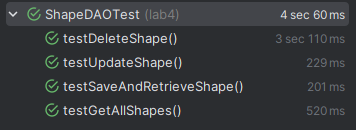

# Lab4 Hibernate

## Wykonanie maina
```
Hibernate:
create table triangles (
a float(53) not null,
alpha float4 not null,
b float(53) not null,
blue integer not null,
c float(53) not null,
green integer not null,
id serial not null,
red integer not null,
primary key (id)
)
[main] INFO lab4.ShapeDAO - Connection successful
Hibernate:
insert
into
rectangles
(red,green,blue,alpha,height,width)
values
(?,?,?,?,?,?)
[main] INFO lab4.ShapeDAO - Connection successful
[main] INFO lab4.ShapeDAO - Connection successful
[main] INFO lab4.ShapeDAO - Connection successful
[main] INFO lab4.ShapeDAO - Connection successful
Hibernate:
insert
into
rectangles
(red,green,blue,alpha,height,width)
values
(?,?,?,?,?,?)
Hibernate:
insert
into
rectangles
(red,green,blue,alpha,height,width)
values
(?,?,?,?,?,?)
Hibernate:
insert
into
triangles
(a,b,c,red,green,blue,alpha)
values
(?,?,?,?,?,?,?)
Hibernate:
insert
into
triangles
(a,b,c,red,green,blue,alpha)
values
(?,?,?,?,?,?,?)
Hibernate:
insert
into
triangles
(a,b,c,red,green,blue,alpha)
values
(?,?,?,?,?,?,?)
[main] INFO lab4.ShapeDAO - Connection successful
[main] INFO lab4.ShapeDAO - Connection successful
Hibernate:
select
r1_0.id,
r1_0.red,
r1_0.green,
r1_0.blue,
r1_0.alpha,
r1_0.height,
r1_0.width
from
rectangles r1_0
[main] INFO lab4.ShapeDAO - Connection successful
Hibernate:
select
t1_0.id,
t1_0.a,
t1_0.b,
t1_0.c,
t1_0.red,
t1_0.green,
t1_0.blue,
t1_0.alpha
from
triangles t1_0
Rectangles:
Rectangle: width = 5.0, height = 10.0Color[red=255, green=255, blue=255, alpha=0.0]
Rectangle: width = 3.0, height = 6.0Color[red=255, green=255, blue=255, alpha=0.0]
Rectangle: width = 7.0, height = 14.0Color[red=255, green=255, blue=255, alpha=0.0]
Triangles:
Triangle: sides = 3.0, 4.0, 5.0Color[red=255, green=255, blue=255, alpha=0.0]
Triangle: sides = 5.0, 12.0, 13.0Color[red=255, green=255, blue=255, alpha=0.0]
Triangle: sides = 8.0, 15.0, 17.0Color[red=255, green=255, blue=255, alpha=0.0]
Hibernate:
drop table if exists rectangles cascade
```

## Testy

```
Hibernate: 
    drop table if exists rectangles cascade
Hibernate: 
    drop table if exists triangles cascade
Hibernate: 
    create table rectangles (
        alpha float4 not null,
        blue integer not null,
        green integer not null,
        height float(53) not null,
        id serial not null,
        red integer not null,
        width float(53) not null,
        primary key (id)
    )
Hibernate: 
    create table triangles (
        a float(53) not null,
        alpha float4 not null,
        b float(53) not null,
        blue integer not null,
        c float(53) not null,
        green integer not null,
        id serial not null,
        red integer not null,
        primary key (id)
    )
[main] INFO lab4.ShapeDAO - Connection successful
Hibernate: 
    insert 
    into
        rectangles
        (red,green,blue,alpha,height,width) 
    values
        (?,?,?,?,?,?)
[main] INFO lab4.ShapeDAO - Connection successful
Hibernate: 
    delete 
    from
        rectangles 
    where
        id=?
[main] INFO lab4.ShapeDAO - Connection successful
Hibernate: 
    select
        r1_0.id,
        r1_0.red,
        r1_0.green,
        r1_0.blue,
        r1_0.alpha,
        r1_0.height,
        r1_0.width 
    from
        rectangles r1_0 
    where
        r1_0.id=?
Hibernate: 
    drop table if exists rectangles cascade
Hibernate: 
    drop table if exists triangles cascade
Hibernate: 
    drop table if exists triangles cascade
Hibernate: 
    create table triangles (
        a float(53) not null,
        alpha float4 not null,
        b float(53) not null,
        blue integer not null,
        c float(53) not null,
        green integer not null,
        id serial not null,
        red integer not null,
        primary key (id)
    )
[main] INFO lab4.ShapeDAO - Connection successful
Hibernate: 
    insert 
    into
        rectangles
        (red,green,blue,alpha,height,width) 
    values
        (?,?,?,?,?,?)
[main] INFO lab4.ShapeDAO - Connection successful
Hibernate: 
    insert 
    into
        rectangles
        (red,green,blue,alpha,height,width) 
    values
        (?,?,?,?,?,?)
[main] INFO lab4.ShapeDAO - Connection successful
Hibernate: 
    select
        r1_0.id,
        r1_0.red,
        r1_0.green,
        r1_0.blue,
        r1_0.alpha,
        r1_0.height,
        r1_0.width 
    from
        rectangles r1_0 
    where
        r1_0.id=?
Hibernate: 
    drop table if exists rectangles cascade
Hibernate: 
    drop table if exists triangles cascade
Hibernate: 
    drop table if exists rectangles cascade
Hibernate: 
    drop table if exists triangles cascade
Hibernate: 
    create table rectangles (
        alpha float4 not null,
        blue integer not null,
        green integer not null,
        height float(53) not null,
        id serial not null,
        red integer not null,
        width float(53) not null,
        primary key (id)
    )
Hibernate: 
    create table triangles (
        a float(53) not null,
        alpha float4 not null,
        b float(53) not null,
        blue integer not null,
        c float(53) not null,
        green integer not null,
        id serial not null,
        red integer not null,
        primary key (id)
    )
[main] INFO lab4.ShapeDAO - Connection successful
Hibernate: 
    insert 
    into
        rectangles
        (red,green,blue,alpha,height,width) 
    values
        (?,?,?,?,?,?)
[main] INFO lab4.ShapeDAO - Connection successful
Hibernate: 
    select
        r1_0.id,
        r1_0.red,
        r1_0.green,
        r1_0.blue,
        r1_0.alpha,
        r1_0.height,
        r1_0.width 
    from
        rectangles r1_0 
    where
        r1_0.id=?
Hibernate: 
    drop table if exists rectangles cascade
Hibernate: 
    drop table if exists triangles cascade
Hibernate: 
    drop table if exists triangles cascade
Hibernate: 
    create table rectangles (
        alpha float4 not null,
        blue integer not null,
        green integer not null,
        height float(53) not null,
        id serial not null,
        red integer not null,
        width float(53) not null,
        primary key (id)
    )
Hibernate: 
    create table triangles (
        a float(53) not null,
        alpha float4 not null,
        b float(53) not null,
        blue integer not null,
        c float(53) not null,
        green integer not null,
        id serial not null,
        red integer not null,
        primary key (id)
    )
[main] INFO lab4.ShapeDAO - Connection successful
Hibernate: 
    insert 
    into
        rectangles
        (red,green,blue,alpha,height,width) 
    values
        (?,?,?,?,?,?)
[main] INFO lab4.ShapeDAO - Connection successful
Hibernate: 
    insert 
    into
        triangles
        (a,b,c,red,green,blue,alpha) 
    values
        (?,?,?,?,?,?,?)
[main] INFO lab4.ShapeDAO - Connection successful
Hibernate: 
    select
        r1_0.id,
        r1_0.red,
        r1_0.green,
        r1_0.blue,
        r1_0.alpha,
        r1_0.height,
        r1_0.width 
    from
        rectangles r1_0
[main] INFO lab4.ShapeDAO - Connection successful
Hibernate: 
    select
        t1_0.id,
        t1_0.a,
        t1_0.b,
        t1_0.c,
        t1_0.red,
        t1_0.green,
        t1_0.blue,
        t1_0.alpha 
    from
        triangles t1_0
Hibernate: 
    drop table if exists rectangles cascade
Hibernate: 
    drop table if exists triangles cascade
```
