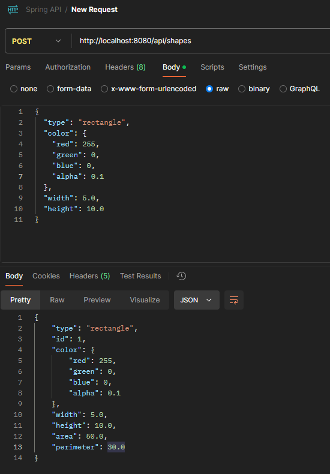
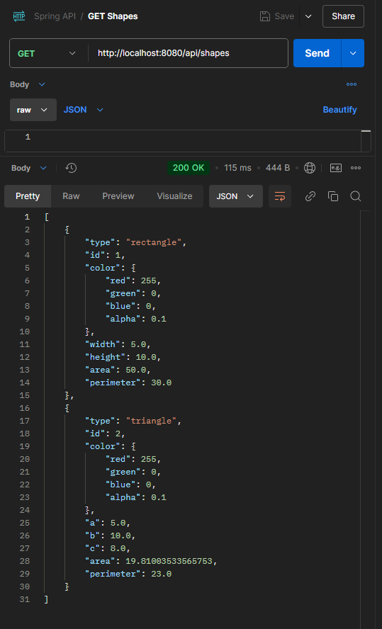

# Lab5 Java Spring Boot + PostgreSQL

Pozwoliłem sobie trochę na modyfikację starego kodu, obecnie Shape nie jest klasą abstrakcyjną, wykorzystuję ją jako Entity w którym przechowywuje wszystkie kolory oraz jako "łącznik" dzięki któremu mogę otrzymać kształty różnego typu jednym zapytaniem. Dzięki takiej implementacji mogę także w łatwy sposób poszerzać aplikacje o kolejne kształty i łatwiej precyzować requesty.

## Wynik działania aplikacji

